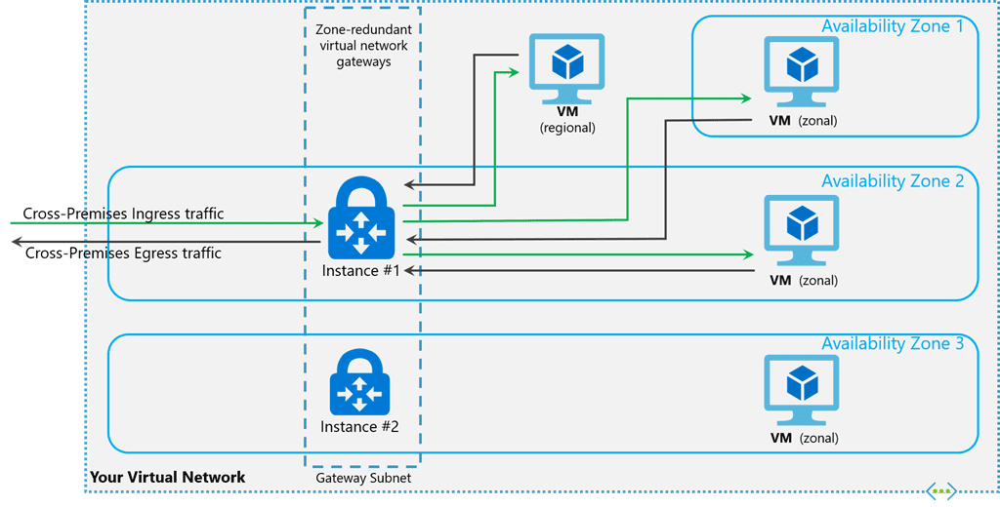

---

title: Azure ExpressRoute Gateway and Public IPs
authors: 
  - simonpainter
tags:
  - azure
  - networks
date: 2025-08-26

---

There are a few things going on with ExpressRoute Gateways and they are related to Public IPs. First of all the retirement of Basic SKU Public IPs for ExpressRoute Gateways is something to be aware of as it has a hard end date and will require a migration to a different SKU. The second one is the HOBO (Hosted On Behalf Of) public IP feature which has an interesting drawback.
<!-- truncate -->
### ExpressRoute Basic SKU Public IP Retirement

This one has been on the roadmap for quite a while but for some it will still be a little bit of a surprise. With [just over a month to go](https://azure.microsoft.com/en-gb/updates?id=upgrade-to-standard-sku-public-ip-addresses-in-azure-by-30-september-2025-basic-sku-will-be-retired?wt.mc_id=MVP_461735) you need to have a plan in place to migrate your ExpressRoute Gateway from Basic SKU Public IPs to Standard SKU Public IPs before 30th September 2025.

There are some excellent documentation resources available to help with this migration process, including [Microsoft's official guidance](https://learn.microsoft.com/en-us/azure/virtual-network/ip-services/public-ip-basic-upgrade-guidance?wt.mc_id=MVP_461735) and it's a great time to make sure you move from a non zonal to a zone redundant configuration.

> **Zone-redundant gateways**
>
> When you create a public IP address using the Standard public IP SKU with zone-redundant option, the behavior differs depending on whether the gateway is a VPN gateway, or an ExpressRoute gateway.
> For a VPN gateway, the two gateway instances are deployed in any two out of these three zones to provide zone-redundancy.
> For an ExpressRoute gateway, since there can be more than two instances, the gateway can span across all the three zones.
>
> **Zonal gateways**
> When you create a public IP address using the Standard public IP SKU and specify the Zone (1, 2, or 3), all the gateway instances are deployed in the same zone.
>
> **Non-zonal or regional gateways**
>
> A non-zonal or regional gateway doesn't have zone-redundancy. These gateways are created in the following scenarios:
> When you create a public IP address using the Standard public IP SKU with the "No Zone" option
> When you create a public IP address using the Basic public IP SKU
>
> [Source - learn.microsoft.com](https://learn.microsoft.com/azure/vpn-gateway/about-zone-redundant-vnet-gateways?toc=%2Fazure%2Fexpressroute%2Ftoc.json&wt.mc_id=MVP_461735#pipskus)

### Wait, but... zonal?

In an effort to make things easier the public IP resource for an [ExpressRoute Gateway is now auto assigned and provisioned under the hood](https://learn.microsoft.com/azure/expressroute/expressroute-about-virtual-network-gateways?wt.mc_id=MVP_461735#auto-assigned-public-ip). This has a, perhaps unintended, side effect because you no longer have the control to be able to provision all of your ExpressRoute Gateways into one Availability Zone. Most people won't want their ExpressRoute Gateways provisioned into a single Availability Zone but there are legitimate use cases for it and it's a level of control that has been removed [without any notice](https://azure.microsoft.com/en-gb/updates?id=498361).

While you can still achieve [this sort of architecture](https://learn.microsoft.com/azure/vpn-gateway/about-zone-redundant-vnet-gateways?wt.mc_id=MVP_461735) with VPN Gateways, you can no longer do so with ExpressRoute Gateways.
