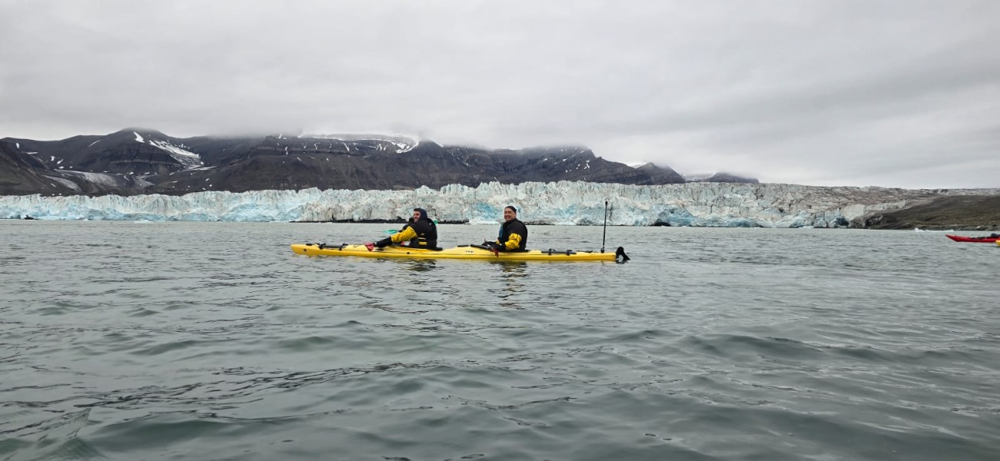

---

title: Lessons from Svalbard
authors: simonpainter
tags:
  - educational
  - personal
  - opinion
  - business

date: 2025-05-09

---

The Arctic wind whipped across my face as I looked up at the entrance of what might be humanity's most important insurance policy. It has been a place that has fascinated me since I read a New Scientist article about it many years ago, and there I was, staring at the concrete wedge jutting from the mountainside, its façade glittering with an art installation that catches the summer Arctic sunlight.
<!-- truncate -->
## An Unexpected Lesson in Disaster Recovery

Last year I visited Svalbard, home of the Global Seed Vault. The trip was planned around doing some kayaking in the arctic waters but it also offered surprising insights into IT disaster recovery practices - and a stark reminder of its real-world importance.

The "doomsday" seed bank, nestled deep in Arctic permafrost, safeguards millions of crop seeds. Its mission? To preserve agricultural biodiversity against global catastrophes.

I'm not a botanist or agricultural expert, I was an IT professional in one of the world's most remote locations. Standing there, I couldn't help but see the striking similarities between this frozen fortress and the backup strategies we implement in our digital worlds.

The parallels to IT backup strategies aren't just coincidental - they're fundamental principles of resilience:

### Geographic Isolation

The vault sits 800 miles inside the Arctic Circle on the Norwegian island of Spitsbergen. This remote location provides natural protection from many threats that might affect multiple locations simultaneously.

It's the physical equivalent of air-gapping critical backups - keeping them completely disconnected from potentially compromised networks.

### Redundancy by Design

The vault doesn't hold original samples - it stores duplicates from gene banks worldwide. This approach preserves the original specimens in their primary locations while creating an additional safety net.

In IT terms, this is like maintaining your near line backups while creating offline backups that remain untouched until needed.

### Environmental Controls with Passive Fallbacks

While the vault has cooling systems to maintain the optimal -18°C temperature for seed preservation, it's also built to take advantage of natural cooling. The permafrost and thick rock provide passive temperature regulation if systems fail.

This reminds me of the best disaster recovery setups, which don't rely solely on active systems that can fail but incorporate passive measures that continue working without power or intervention.

### Regular Updates

The vault receives new deposits from around the world, keeping its collection current and comprehensive. It's not a static resource but a living archive that grows and evolves.

Just like our backup systems shouldn't be "set and forget" solutions but regularly updated repositories that reflect our changing data landscape.

## From Theoretical to Practical: The Syrian Withdrawal

Recent events have proven the vault's critical value. In 2015, the Syrian civil war led to the first-ever withdrawal from the vault. The International Center for Agricultural Research in the Dry Areas (ICARDA) requested the return of some of its samples after its Aleppo facility became inaccessible due to conflict.

This wasn't a hypothetical doomsday scenario from a disaster planning exercise. It was a real organisation facing a real crisis that had compromised their primary facility.

The seeds from Svalbard allowed ICARDA to establish new gene banks in Morocco and Lebanon, effectively "restoring from backup" their invaluable collection of drought-resistant crops from the Fertile Crescent - the birthplace of agriculture.

This real-world example underscores a crucial lesson for IT professionals: disasters aren't just hypothetical scenarios. They can and do happen, often in unexpected ways.

## The Vault's Design Philosophy

The vault relies on multiple layers of protection:

- It's built high above sea level to protect against rising waters and flooding
- It uses permafrost and thick rock for natural cooling, reducing dependency on artificial systems
- Its contents are duplicates, preserving original samples in their primary locations when possible
- The facility is designed to run with minimal human intervention

Standing in that harsh landscape, I couldn't help but think about our own backup strategies. How many of these principles do we truly incorporate?

## A Reminder of Real Stakes

The Seed Vault reminds us: Whether it's crops or data, robust backup strategies are essential for our collective future. And as the Syrian example shows, these aren't just theoretical precautions - they're practical necessities in an unpredictable world.

As I left Svalbard, I carried with me not just photos of a unique experience but a renewed perspective on my role in ensuring resilleince of critical infrastructure. Our work in creating systems isn't just about meeting compliance requirements or following best practices - it's about creating safety nets that might one day prove as crucial as those frozen seeds.

In IT, we often talk about disaster recovery in abstract terms. The Global Seed Vault makes it concrete. It's a physical manifestation of hope and foresight - qualities we should all bring to our work in protecting the digital resources that power our world.
