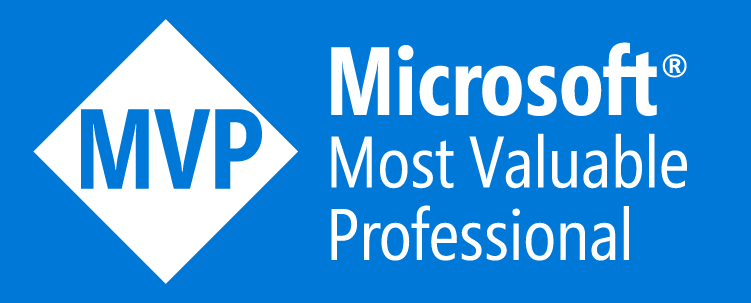

---

title: Microsoft Most Valuable Professional
authors: simonpainter
tags:
  - personal
  - azure
  - networks
date: 2025-06-01

---

So here's something I definitely didn't see coming when I started my blog, I just got the email that I've been awarded [Microsoft Most Valuable Professional (MVP)](https://mvp.microsoft.com/en-US/MVP/profile/b2f997ef-b877-45ff-9504-cea463f548b5) status for Cloud and Datacenter Management - On-Premises Networking.
<!-- truncate -->
## How Did This Even Happen?

Honestly, this whole thing started pretty selfishly. I began blogging as a digital notebook - a place to dump solutions to problems I'd figured out so I wouldn't have to solve them again. There's nothing quite like the experience of googling a problem, finding the perfect solution, and realising it's from your own blog post that you'd completely forgotten writing the last time you had that problem!

But then something happened. I kept adding more content because I figured it might help other people who were going through the same journey I was - transitioning from traditional network engineering and architecture into this whole cloud networking world. Turns out I wasn't wrong about that.

## From Network Cables to Cloud Configs

The shift from physical networking to cloud networking is... well, it's a thing. A big thing. What started as "let me figure out how Azure networking actually works" has turned into watching an entire discipline emerge. Cloud networking isn't just traditional networking with a fancy UI - it's its own beast with its own challenges, best practices, and head-scratching moments.

My blog became this weird collection of "here's how I solved this networking problem in the cloud" and "why does this work differently than I expected?" And apparently, enough people found it useful that someone thought I should get a shiny award for it.

## What's an MVP Anyway?

For those who don't know, Microsoft MVPs are basically community contributors who share what they know. ~~They're~~ We're not Microsoft employees - we're just people who've decided that when we figure something out, we should probably tell other people about it too.

The whole thing is built around the idea that the best way to learn is to teach, and the best way to solve problems is to share solutions. Which, coincidentally, is exactly why I started writing things down in the first place.

> There are only about 3500 Microsoft MVPs in the world. Weirdly there is now some unlikely
> over representation in the community by people called [Simon Painter](https://mvp.microsoft.com/en-US/MVP/profile/f0449906-0cce-ed11-a7c6-000d3a5603d3) - if anyone wants to book us as a double act I think he'd be up for it.

## What's Next?

Being an MVP comes with some pretty cool perks - early access to new stuff, direct lines to product teams, and a network of other people who are just as excited about technology as I am. But honestly, the best part is just knowing that this thing I started for purely selfish reasons has actually helped people.

I'm planning to keep doing exactly what I've been doing - solving problems, writing about them, and hopefully making the cloud networking journey a little less painful for everyone else. Just now with a fancier badge to go with it.

## Thank you

This wouldn't have happened without all the people who've read the blog, asked questions, shared their own solutions, and generally made me feel like this was worth doing. Also thanks to a lot of people for putting up with me constantly saying "oh, I should write a blog post about that" - you know who you are.

And obviously, thanks to [Adam](https://www.linkedin.com/in/adamsharif/) who nominated me for it.
