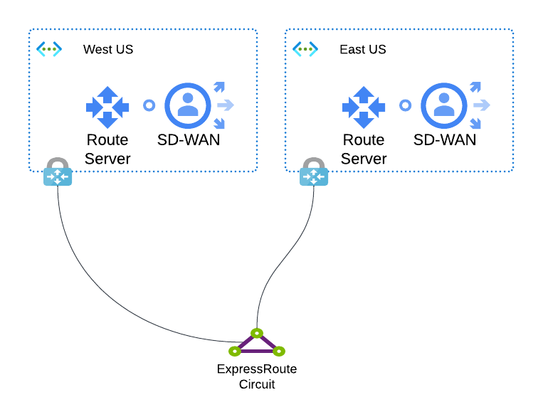

---

title: Transit route prevention with Azure Route Server
authors: simonpainter
tags:
  - azure
  - networks
  - bgp
date: 2024-11-17

---

I wrote an article about a rather neat solution for global application delivery in Azure via [anycast](anycast-route-server.md), however there are some limitations which exist to prevent transit routing in Azure that I'd like to discuss further.
<!-- truncate -->
### The behaviour

When you have two VNets sharing an ExpressRoute circuit, each with their own ExpressRoute Gateway and a Route Server with branch-to-branch communications turned on, the routes learned by one won't be propagated to the other. This is an explicit behaviour to prevent transit routing between Network Virtual Appliances (NVAs) over the Microsoft backbone. 

Let me explain with an example: imagine those NVAs are SD-WAN appliances in different regions in a geopolitical space, perhaps two separate US regions. Those regions have distinct ExpressRoute Gateways but share an ExpressRoute circuit. If routes were propagated between these two regions, then traffic from branch offices connected externally to either region would transit via the Microsoft backbone to an office connected via the other region. This is, understandably, not something Microsoft wants to allow.

### The relevance

Where this becomes relevant to the anycast solution is in topologies where you have more than one hub VNet with a Route Server and an anycast NVA, and they share an ExpressRoute circuit. If you strictly maintain a one ExpressRoute Gateway to one ExpressRoute Circuit mapping, then you won't experience this limitation. However, if you share ExpressRoute Circuits across more than one of your hubs that use Route Server (or by extension more than one Virtual WAN hub), then you'll find that routes learned by one aren't propagated to the other.

Consider the diagram above. Prefixes injected in VNet A won't be received in B. They will, however, be received in VNets C and D, provided the WAN that both ExpressRoute circuits are connected to allows it. Prefixes injected into VNet C will be received into all other VNets. 

In this example, it might be problematic if you have a workload in a spoke VNet connected to hub VNet B which needs to access the anycast VIP. During normal operation, when the VIP is injected in VNet B directly via its own NVA, everything will be fine. However, if that instance fails, the workload wouldn't be able to reach the next closest instance in VNet A.

### The available options

You can mitigate this by maintaining a 1:1 relationship with ExpressRoute Gateways and ExpressRoute Circuits, but that's not always an available option due to cost and complexity. Maintaining a 1:1 relationship with Route Servers to ExpressRoute Gateways is more feasible, and this can drive you towards regional anycast NVAs. That then brings the [Route Server prefix limit](https://learn.microsoft.com/en-us/azure/route-server/route-server-faq#how-is-the-1000-route-limit-calculated-on-a-bgp-peering-session-between-an-nva-and-azure-route-server) into play when working at scale.

### My recommended approach

After dealing with this limitation in several client environments, I've found that the most practical approach is to carefully plan your ExpressRoute Circuit to Gateway mapping at the beginning of your deployment. If you know you'll need anycast capabilities across regions, try to maintain that 1:1 relationship where possible.

For environments where cost constraints make that difficult, consider using regional anycast VIPs instead of a global VIP. This approach means each region advertises its own unique VIP, and you'll need to use DNS-based load balancing to direct clients to the appropriate regional endpoint. While this doesn't provide the seamless failover that true anycast offers, it's often a reasonable compromise given Azure's architectural constraints.

In very large environments where the Route Server prefix limit becomes a concern, I've seen success with a hybrid approach: use anycast for your most critical services that need rapid failover, and use DNS-based routing for everything else. This keeps your BGP routing table manageable while still providing resilience for your most important workloads.

Remember that Microsoft's stance on transit routing is unlikely to change, as it relates to fundamental backbone design decisions. Building your architecture with these constraints in mind from the start will save you significant headaches down the road.