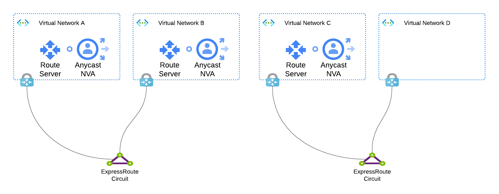

---

title: Transit route prevention with Azure Route Server
authors: spainter
tags:
  - azure
  - networks

---

I wrote an article about a rather neat solution for global application delivery in Azure via [anycast](anycast-route-server.md) however there are some limitations which exist to prevent transit routing in Azure.
<!-- truncate -->
### The behaviour

Where you have two vnets sharing an expressroute circuit, each with their own ErGateway and a route server and with branch to branch communications turned on, the routes learned by one will not be propagated to the other. This is an explicit behaviour to prevent transit routing between NVAs over the Microsoft backbone. Consider the example where those NVAs are SDWAN appliances in different regions in a geopolitical space, perhaps two separate US regions. Those regions have distinct ErGateways but share an ExpressRoute circuit. If routes were progagated between these two regions then traffic from branch offices connected externally to either region would transit via the Microsoft backbone to an office connected via the other region; this is, understandably, not desirable for Microsoft.

### The relevance

Where this is relevant to the anycast solution is in topologies where you have more than one hub vnet with a route server and an anycast NVA and they share an ExpressRoute circuit. If you strictly maintain a one ErGateway to one ErCircuit mapping then you will not experience this limitation. If you share ErCircuits across more than one of your hubs that use RouteServer (or by extension more than one vWAN hub) then you will find that routes learned by one are not propagated to the other.

Consider the diagram above. Prefixes injected in vnet A will not be received in B. They will, however be received in vnets C and D provided the WAN that both ExpressRoute circuits are connected to allows it. Prefixes injected into vnet C will be received into all other vnets. In this example it might be problematic if you have a workload in a spoke vnet connected to hub vnet B which needs to be able to access the anycast VIP. During normal operation, when the VIP is injected in vnet B directly via its own NVA, everything will be fine however if that instance fails the workload would not be able to reach the next closest instance in vnet A.

### The available options

This can be mitigated by maintaining a 1:1 relationship with ErGateways and ErCircuits but that's not always an available option due to cost and complexity. Maintaining a 1:1 relationship with RouteServers to ErGateways is more feasible and this can drive you towards regional anycast NVAs; that then brings the [RouteServer prefix limit](https://learn.microsoft.com/en-us/azure/route-server/route-server-faq#how-is-the-1000-route-limit-calculated-on-a-bgp-peering-session-between-an-nva-and-azure-route-server) in to play when working at scale.
